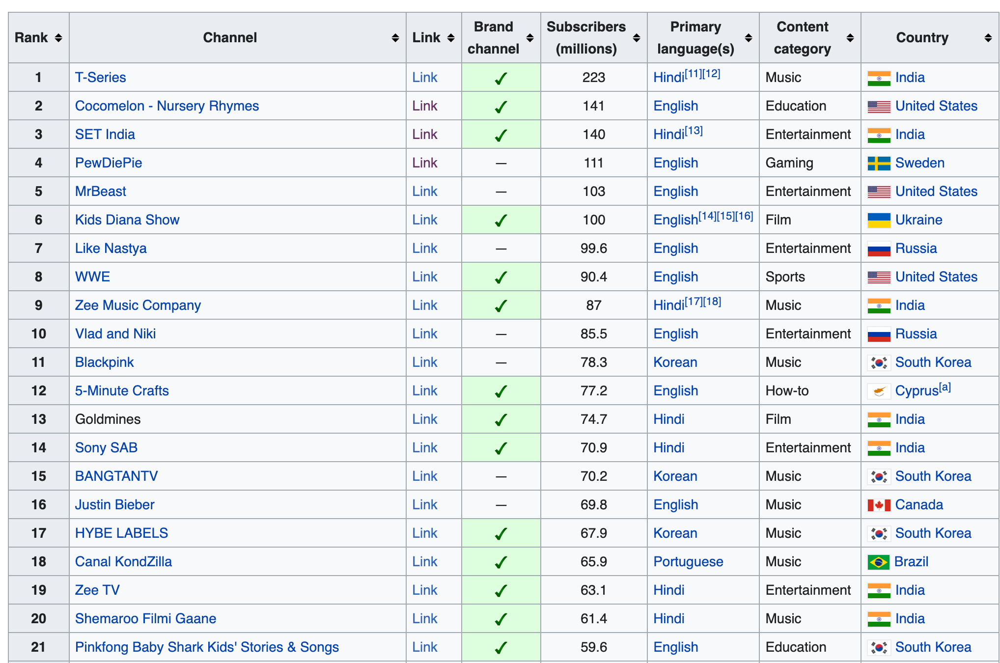
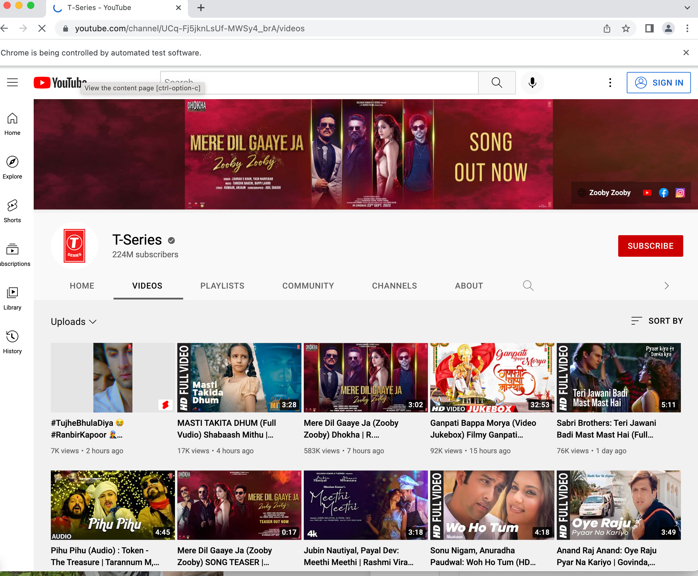
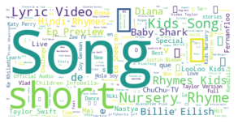

# Webscraping-Youtube

## Overview

Using Beatiful Soup and Splinter, the titles of Youtube videos were scraped, along with the number of views and time of posting. The videos chosen were the most recent videos posted by the top 50 most subscribed YouTube channels. The goal was to determine the most frequently used words used by the most popular channels. A word cloud was constructed to visualize this distribution.

## Images

The following image shows the table from the [wikipedia website](https://en.wikipedia.org/wiki/List_of_most-subscribed_YouTube_channels). This table contains the names of the top 50 subscribed channels along with a link to their Youtube homepage.

The two images below are examples of the webpages the program visits.

Once the video titles were scraped, a wordcloud was constructed in Python. Here is an example created on August 30th, 2022.

This data is scraped from the web in real-time, meaning a new word cloud can be generated to visualize the most current words populating YouTube video titles.

As with most webscraping projects, the program may fail in the future if either Wikipedia or YouTube change the html formats of their website. Nonetheless, the project was successful and provided insight into how Youtube channels market their content.  
