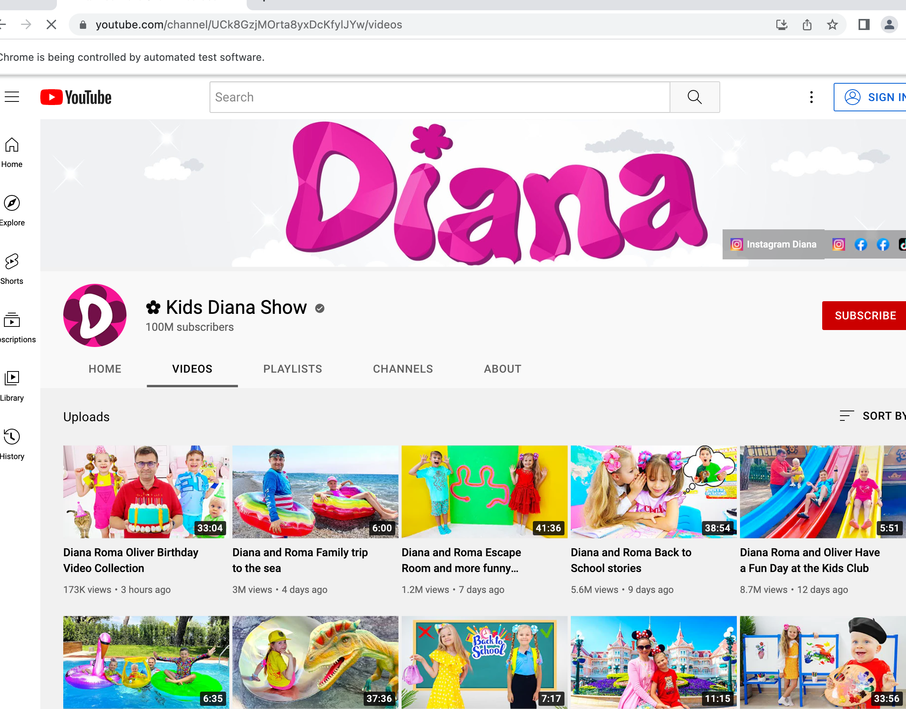
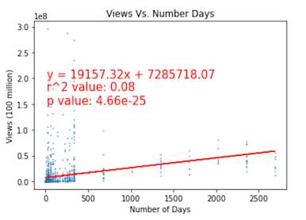

# Webscraping-Youtube

## Overview

Using Beatiful Soup and Splinter, the titles of Youtube videos were scraped, along with the number of views and time of posting. The videos chosen were the most recent videos posted by the top 50 most subscribed YouTube channels. The goal was to determine the most frequently used words used by the most popular channels. A word cloud was constructed to visualize this distribution.

## Images

The following image shows the table from the [wikipedia website](https://en.wikipedia.org/wiki/List_of_most-subscribed_YouTube_channels). This table contains the names of the top 50 subscribed channels along with a link to their Youtube homepage.

The two images below are examples of the webpages the program visits.

## Results

Once the video titles were scraped, a wordcloud was constructed in Python. Here is an example created on August 30th, 2022. The most common words were "short" and "song", along with phrases such as "nursery rhymes".

Scatter plots and regression lines were plotted for views against 1) number of characters in title and 2) number of days since posted. Both linear regressions are statistically significant, but the effect sizes, measured by r-squared, are relatively small. The p-value for views vs number of characters in title is less than 0.05, but the r-squared value is 0.037. This confirms that vews and length of title is negatively correlated, but not by a large amount. 

The p-value for views vs number of days is less than 0.05, but the r-squared values is 0.08. This low effect size suggests that most of the views are obtained in the first few days and then cease to increase afterwards.

On average, Blackpink and T-Series videos were the most viral, when measured in views per day.

## Discussion

This data is scraped from the web in real-time, meaning a new word cloud can be generated to visualize the most current words populating YouTube video titles.

As with most webscraping projects, the program may fail in the future if either Wikipedia or YouTube change the html formats of their website. Nonetheless, the project was successful and provided insight into how Youtube channels market their content.  
